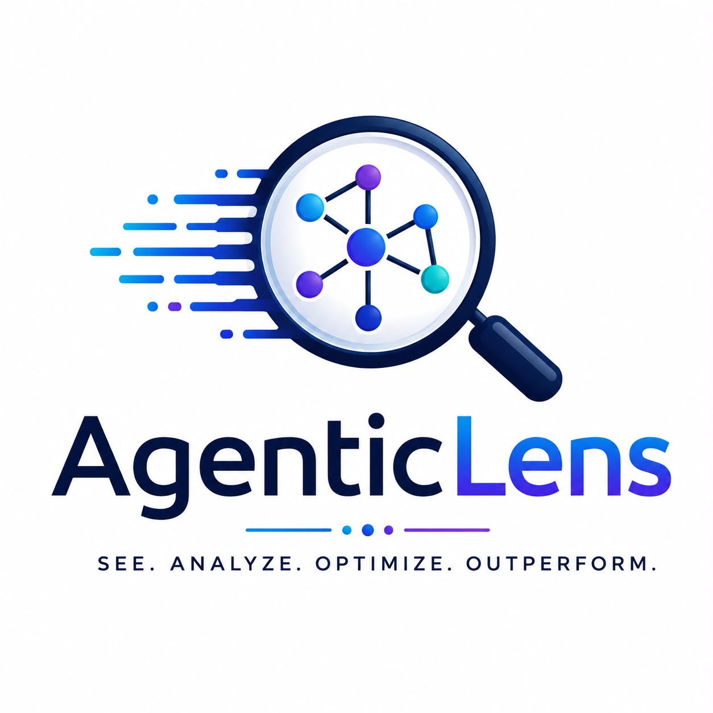

# AgenticLens

<<<<<<< HEAD
<p align="center">
  
</p>

**Open-source evaluation and profiling for production-ready agentic AI systems.**

[](https://github.com/DeepAgentLabs/agenticlens/actions/workflows/ci.yml)
[](https://github.com/DeepAgentLabs/agenticlens/actions/workflows/docs.yml)
[](https://pypi.org/project/agenticlens/)
[](https://pypi.org/project/agenticlens/)
[](LICENSE)
[](https://github.com/DeepAgentLabs/agenticlens/stargazers)
[](https://github.com/DeepAgentLabs/agenticlens/forks)
[](https://pepy.tech/project/agenticlens)

| Public asset | Link |
| --- | --- |
| Website and docs | [GitHub Pages](https://deepagentlabs.github.io/agenticlens/) |
| Technical specification | [AgenticLens_Spec.md](AgenticLens_Spec.md) |
| Roadmap | [ROADMAP.md](ROADMAP.md) |

AgenticLens is an open-source Python profiler for LLM applications and agentic
workflows. It helps developers understand where tokens, latency, and cost are
spent, then turns that profile into actionable budget optimization
recommendations.

Think of it as a lightweight, local `cProfile` for AI workflows: no hosted
dashboard, no required backend, no account, and no data egress just to inspect a
run.

## Why AgenticLens?

LLM applications rarely spend money in one place. Cost often leaks across
planners, retrievers, memory, tool calls, repeated system prompts, and final
response steps.

Most observability tools can show token usage. AgenticLens focuses on the next
question:

> What should I change to reduce the bill?

AgenticLens currently detects patterns such as:

- repeated system prompts that may be cached or deduplicated
- excessive retrieved chunks in RAG workflows
- low-utility retrieved chunks that appear unlikely to affect the final answer
- long conversation history that should be summarized or truncated
- duplicate tool calls that should be cached
- projected token, dollar-per-run, and monthly savings

## Status

AgenticLens is early-stage software. The core profiling, cost calculation,
export, CLI, and rule-based recommendation engine are implemented, but the API
may still evolve before a stable 1.0 release.

## Installation

For local development from this repository:

```bash
git clone https://github.com/DeepAgentLabs/agenticlens.git
cd agenticlens
uv sync --extra dev
```

If you do not use `uv`, install in editable mode with development extras:

```bash
python -m venv .venv
. .venv/bin/activate
pip install -e ".[dev]"
```

On Windows PowerShell:

```powershell
python -m venv .venv
.\.venv\Scripts\Activate.ps1
pip install -e ".[dev]"
```

## Quickstart

Instrument your workflow with explicit `profile()` and `step()` blocks:

```python
from agenticlens import profile, step

with profile("Customer Support Agent"):
    with step(
        "Planner",
        type="planner",
        provider="openai",
        model="gpt-4o-mini",
        prompt=planner_prompt,
    ) as s:
        response = planner_llm.invoke(planner_prompt)
        s.record(response)

    with step(
        "Retriever",
        type="retriever",
        chunk_count=12,
        avg_tokens_per_chunk=80,
    ):
        chunks = retriever.search(user_question)

    with step(
        "Final Answer",
        type="final_response",
        provider="openai",
        model="gpt-4o-mini",
        final_answer="Refunds are processed to the original payment method.",
    ) as s:
        response = answer_llm.invoke(final_prompt)
        s.record(response)
```

Then profile and analyze a script:

```bash
uv run agenticlens profile examples/recommendations_demo.py --save workflow.json
uv run agenticlens analyze workflow.json
```

Example output:

```text
Budget Optimization Run cost: $0.0068; reducible: ~$0.0024/run (35%), ~$2.38/month.

Optimization Suggestions
  * Long conversation history
  * Excessive retrieved chunks
  * Repeated system prompt
  * Low-utility retrieved chunks
  * Duplicate tool call

Estimated Savings: 35%
```

## Core Concepts

### Workflow

A workflow is one complete execution of an LLM application, such as answering a
customer support question or running a multi-agent task.

```python
with profile("Refund Support"):
    ...
```

### Step

A step is a meaningful unit inside that workflow: planner, retriever, memory,
tool call, LLM call, or final response.

```python
with step("Retrieve Policy Chunks", type="retriever", chunk_count=10):
    ...
```

### Recommendation

A recommendation is a rule-based optimization suggestion. Recommendations carry
token savings, estimated percentage savings, dollar impact when pricing is
known, confidence when relevant, and quality-risk notes for heuristics such as
RAG chunk utility.

## Features

| Area | Capability |
| --- | --- |
| Profiling | Explicit `profile()` and `step()` context managers |
| Metrics | Prompt tokens, completion tokens, total tokens, latency, TPS, cost |
| Providers | OpenAI and Anthropic response usage extraction |
| Costing | Local pricing table plus user pricing overrides |
| Recommendations | Repeated prompts, excessive chunks, low-utility chunks, long history, duplicate tool calls |
| Budget impact | Dollar-per-run and monthly savings projections |
| Integrations | Auto-instrumentation adapter for LangChain / LangGraph via callbacks |
| CLI | `profile`, `report`, and `analyze` commands |
| Export | JSON, CSV, Markdown, and Jira workflow export |
| Tooling | pytest, Ruff, mypy, GitHub Actions |

## Cost Calculation

AgenticLens does not pull live prices from the internet. It uses a local pricing
table in `src/agenticlens/config/pricing.yaml` and this formula:

```text
input_cost = (prompt_tokens / 1000) * input_price_per_1k
output_cost = (completion_tokens / 1000) * output_price_per_1k
total_cost = input_cost + output_cost
```

Pricing resolution order:

1. User-supplied pricing override
2. Bundled `pricing.yaml`
3. Unknown model -> cost is reported as `None`, not `$0.00`

This keeps reporting honest when model pricing is missing or stale.

## RAG Chunk Utility

The RAG utility rule identifies retrieved chunks that are unlikely to influence
the final answer. It supports multiple signal types (in priority order):

| Signal Type | Supported Fields | Source |
| --- | --- | --- |
| Citation | `cited`, `used`, `referenced` (boolean) | Your app logic |
| Reranker | `reranker_score`, `rerank_score`, `cross_encoder_score` (0–1) | Cross-encoder models |
| Embedding | `embedding_similarity`, `cosine_similarity`, `semantic_score` (0–1) | Vector search |
| Generic | `utility_score`, `relevance_score` (0–1) | Custom scoring |
| Fallback | Word-overlap against final answer | Automatic |

Example chunk metadata:

```python
{"text": "...", "reranker_score": 0.92}
{"text": "...", "cosine_similarity": 0.85}
{"text": "...", "cited": True}
{"text": "...", "utility_score": 0.12}
```

When rich signals (reranker, embedding, citation) are available, confidence is
higher and quality risk is lower. If no explicit signals are present, it falls
back to lightweight word-overlap against the final answer.

For a complete guide, see [docs/rag-chunk-utility.md](docs/rag-chunk-utility.md).

## Examples

Run the recommendation demo:

```bash
uv run agenticlens profile examples/recommendations_demo.py --save workflow.json
uv run agenticlens analyze workflow.json
```

Other examples:

- `examples/basic_usage.py`
- `examples/rag_customer_support_demo.py`
- `examples/multiagent_support_demo.py`
- `examples/export_demo.py` — export to Markdown and Jira
- `examples/rag_scoring_demo.py` — RAG chunk utility with reranker/embedding/citation signals

Some examples call real provider APIs and require provider API keys.

## Framework Benchmarks

`benchmarks/` runs the same practical refund-ticket workload through
AutoGen, CrewAI, LangGraph, LlamaIndex, Semantic Kernel, and native Python,
profiling each with AgenticLens to normalize tokens, cost, latency, tool
calls, and retrieved chunks across implementations. See
[benchmarks/results/benchmark_summary.md](benchmarks/results/benchmark_summary.md)
for the current comparison table.

## Notebooks

Beginner-friendly notebooks are available in:

- `notebooks/agenticlens_workflow_demo_beginner.ipynb`
- `notebooks/agenticlens_multiagent_demo_beginner.ipynb`

The notebooks walk through step-by-step RAG and multi-agent profiling, token
usage tables, latency/cost charts, saved AgenticLens reports, and optimization
analysis.

## Exporting Reports

### Markdown

```python
from agenticlens.exporters import MarkdownExporter

MarkdownExporter().export(workflow, "report.md")
```

### With Recommendations

All exporters accept an optional `recommendations` parameter (Jira currently ignores it):

```python
from agenticlens.exporters import MarkdownExporter, JSONExporter, CSVExporter
from agenticlens.recommenders import RecommendationEngine

engine = RecommendationEngine()
recs = engine.run(workflow)

MarkdownExporter().export(workflow, "report.md", recommendations=recs)
JSONExporter().export(workflow, "report.json", recommendations=recs)
CSVExporter().export(workflow, "steps.csv", recommendations=recs)
# CSV also writes steps_recommendations.csv alongside
```

### Jira Integration

Post profiling results directly as a comment on a Jira issue:

```python
from agenticlens.exporters import JiraExporter

JiraExporter(
    base_url="https://yourteam.atlassian.net",
    user_email="you@example.com",
    api_token="your-api-token",
    issue_key="PROJ-123",
).export(workflow)
```

Set credentials via environment variables for safety — see
`examples/export_demo.py` for a complete example.

For sample output previews of all formats, see [docs/export-formats.md](docs/export-formats.md).

## LangChain Integration

Auto-instrument a LangChain (or LangGraph) run via its callback system instead
of wrapping every call in `step()`:

```bash
pip install "agenticlens[langchain]"
```

```python
from agenticlens import profile
from agenticlens.adapters.langchain import AgenticLensCallbackHandler

with profile("My LangChain App") as workflow:
    chain.invoke(inputs, config={"callbacks": [AgenticLensCallbackHandler()]})
```

LLM calls, tool calls, and retriever calls are tracked automatically as
`llm_call`, `tool_call`, and `retriever` steps, with token usage extracted the
same way `s.record(...)` does. See
[docs/langchain-integration.md](docs/langchain-integration.md) for details on
what is and isn't tracked.

## CLI Reference

Profile a Python script:

```bash
uv run agenticlens profile app.py
```

Save a workflow report:

```bash
uv run agenticlens profile app.py --save workflow.json
```

Display a saved workflow:

```bash
uv run agenticlens report workflow.json
```

Analyze a saved workflow:

```bash
uv run agenticlens analyze workflow.json
```

## Development

Install development dependencies:
=======
AgenticLens is an open-source profiler for LLM applications, RAG pipelines, and agentic workflows.

It helps developers understand where tokens, cost, and latency are being spent across each step of an AI workflow.

> **Status:** MVP. Core profiling, CLI reports, exporters, and heuristic recommendation rules are implemented.

AgenticLens tracks:

- Prompt tokens
- Completion tokens
- Total tokens
- Estimated cost
- Latency
- Workflow steps
- Tool calls
- Retrieval metadata
- Optimization opportunities

## Why AgenticLens?

LLM applications often become expensive and slow as they grow from simple prompts into RAG pipelines, tool-using agents, and multi-agent workflows.

AgenticLens gives developers a lightweight way to answer:

- Which step used the most tokens?
- Which agent was most expensive?
- Did retrieval send too many chunks?
- Is conversation history too large?
- Are we repeating the same system prompt?
- Did the workflow call the same tool twice?
- How much token usage can be reduced?

## Installation

### From PyPI

```bash
pip install agenticlens
```

### Development Install
>>>>>>> 95f3b5153710a2ab4db1215ef2cbfdc27b64913d

```bash
uv sync --extra dev
```

<<<<<<< HEAD
Run the test suite:

```bash
uv run pytest
```

Run linting, formatting, and type checks:

```bash
uv run ruff check .
uv run ruff format .
uv run mypy
```

Useful targeted checks while working:

```bash
uv run ruff check src tests
uv run ruff format --check src tests
```

## Project Structure

```text
src/agenticlens/
  profiler/       workflow and step profiling
  metrics/        cost and performance calculation
  providers/      provider response usage extraction
  recommenders/   rule-based optimization suggestions
  exporters/      JSON, CSV, Markdown, and Jira exports
  cli/            Typer CLI and Rich rendering
  config/         pricing and settings
  models/         Pydantic data models
```

## Roadmap

Near-term priorities:

- model-tier mismatch detection
- prompt caching opportunity detection
- integrations for LiteLLM and OpenAI Agents SDK (LangChain / LangGraph done —
  see [docs/langchain-integration.md](docs/langchain-integration.md))
- OpenTelemetry and OpenInference trace import
- optional prompt compression handoff

See [ROADMAP.md](ROADMAP.md) and [AgenticLens_Spec.md](AgenticLens_Spec.md) for
more detail.

## Contributing

Contributions are welcome. Good first areas include:

- provider integrations
- recommender rules
- example workflows
- docs and tutorials
- export formats
- test coverage

Please read [CONTRIBUTING.md](CONTRIBUTING.md) before opening a pull request.

## Security

Please report vulnerabilities privately. See [SECURITY.md](SECURITY.md).

## Code of Conduct

This project follows [CODE_OF_CONDUCT.md](CODE_OF_CONDUCT.md).

## License

AgenticLens is released under the MIT License. See [LICENSE](LICENSE).
=======
or:

```bash
pip install -e .
```

## Quick Start

```python
from agenticlens import profile, step

with profile("Customer Support") as workflow:
    with step(
        "Planner",
        type="planner",
        provider="openai",
        model="gpt-4o-mini",
    ) as s:
        response = planner_llm.invoke(prompt)
        s.record(response)

print(workflow.total_tokens)
print(workflow.total_cost)
```

## Core Concepts

| Concept | Meaning |
|---|---|
| `profile()` | Starts profiling one workflow |
| `step()` | Tracks one operation inside the workflow |
| `s.record(response)` | Extracts token usage from an LLM response |
| `provider` | LLM provider, such as `openai` or `anthropic` |
| `model` | Model name used for cost estimation |
| `metadata` | Extra step details such as retrieved chunks, tool names, prompts, or history size |

## Supported Step Types

AgenticLens supports these step types:

```text
planner
retriever
memory
tool_call
llm_call
final_response
```

## CLI Usage

Run and profile a Python script:

```bash
agenticlens profile examples/basic_usage.py
```

Save a workflow report:

```bash
agenticlens profile examples/basic_usage.py --save report.json
```

View a saved report:

```bash
agenticlens report report.json
```

Analyze optimization opportunities:

```bash
agenticlens analyze report.json
```

## Example Output

```text
╔═ Customer Support ═╗
║ Total Tokens   160 ║
║ Total Cost     $0.00 ║
║ Latency        0.12 sec ║
╚═══════════════════╝

Step Breakdown

Planner    planner    120 prompt    40 completion
```

## RAG Example

```python
from agenticlens import profile, step

with profile("RAG Workflow") as workflow:
    with step(
        "Retrieve Chunks",
        type="retriever",
        chunk_count=5,
        avg_tokens_per_chunk=120,
    ):
        chunks = retriever.search(query)

    with step(
        "Generate Answer",
        type="llm_call",
        provider="openai",
        model="gpt-4o-mini",
    ) as s:
        response = llm.invoke(query, context=chunks)
        s.record(response)
```

## Multi-Agent Example

```python
from agenticlens import profile, step

with profile("Multi-Agent Support Workflow") as workflow:
    with step(
        "Planner Agent",
        type="planner",
        provider="openai",
        model="gpt-4o-mini",
    ) as s:
        response = planner_agent.run(user_query)
        s.record(response)

    with step(
        "Retriever Agent",
        type="retriever",
        chunk_count=8,
    ):
        chunks = retriever.search(user_query)

    with step(
        "Tool Agent - Lookup Order",
        type="tool_call",
        tool_name="lookup_order",
        tool_args={"order_id": "A123"},
    ):
        order = lookup_order("A123")

    with step(
        "Final Response Agent",
        type="final_response",
        provider="openai",
        model="gpt-4o-mini",
    ) as s:
        response = final_agent.run(user_query, chunks, order)
        s.record(response)
```

## Optimization Recommendations

AgenticLens can identify common token waste patterns:

| Recommendation | Meaning |
|---|---|
| Repeated system prompt | Same long prompt appears across multiple steps |
| Excessive retrieved chunks | Retriever sends more chunks than the configured limit |
| Long conversation history | Memory/history exceeds the configured token threshold |
| Duplicate tool call | Same tool is called again with the same arguments |

Example:

```bash
agenticlens analyze report.json
```

Output:

```text
Optimization Suggestions

* Repeated system prompt
  -- Step 'Final Response' repeats the same prompt prefix as 'Planner'. (~295 tokens)

* Excessive retrieved chunks
  -- Step 'Retriever' retrieved 12 chunks, 4 more than the configured limit of 8. (~320 tokens)

Estimated Savings: 32%
```

## Exporters

AgenticLens supports exporting workflow reports.

```python
from agenticlens.exporters import JSONExporter, CSVExporter

JSONExporter().export(workflow, "report.json")
CSVExporter().export(workflow, "steps.csv")
```

## Examples

Example scripts are available in:

```text
examples/basic_usage.py
examples/recommendations_demo.py
examples/rag_customer_support_demo.py
examples/multiagent_support_demo.py
```

## Notebooks

Beginner-friendly notebooks are available in:

```text
notebooks/agenticlens_workflow_demo_beginner.ipynb
notebooks/agenticlens_multiagent_demo_beginner.ipynb
```

The notebooks show:

- Step-by-step RAG profiling
- Step-by-step multi-agent profiling
- Token usage tables
- Latency charts
- Cost charts
- Saved AgenticLens reports
- Optimization analysis

## Development

Install development dependencies:

```bash
uv sync --extra dev
```

Run tests:

```bash
uv run pytest
```

Run linting:

```bash
uv run ruff check .
```

Format code:

```bash
uv run ruff format .
```

Run type checks:

```bash
uv run mypy
```

## Test Status

The current test suite covers:

- CLI commands
- Profiling API
- Models
- Providers
- Pricing
- Exporters
- Recommendation engine
- Recommendation rules

Example:

```bash
pytest -v
```

Expected result:

```text
42 passed
```

## Project Docs

See:

- [AgenticLens_Spec.md](AgenticLens_Spec.md)
- [ROADMAP.md](ROADMAP.md)

## Positioning

AgenticLens is a lightweight, developer-first profiler for token usage, cost, latency, and optimization suggestions.

It is not intended to replace full observability platforms such as LangSmith, Langfuse, Helicone, or Phoenix. It is designed to be simple, local-first, and easy to add to Python-based LLM workflows.

## License

MIT
>>>>>>> 95f3b5153710a2ab4db1215ef2cbfdc27b64913d
