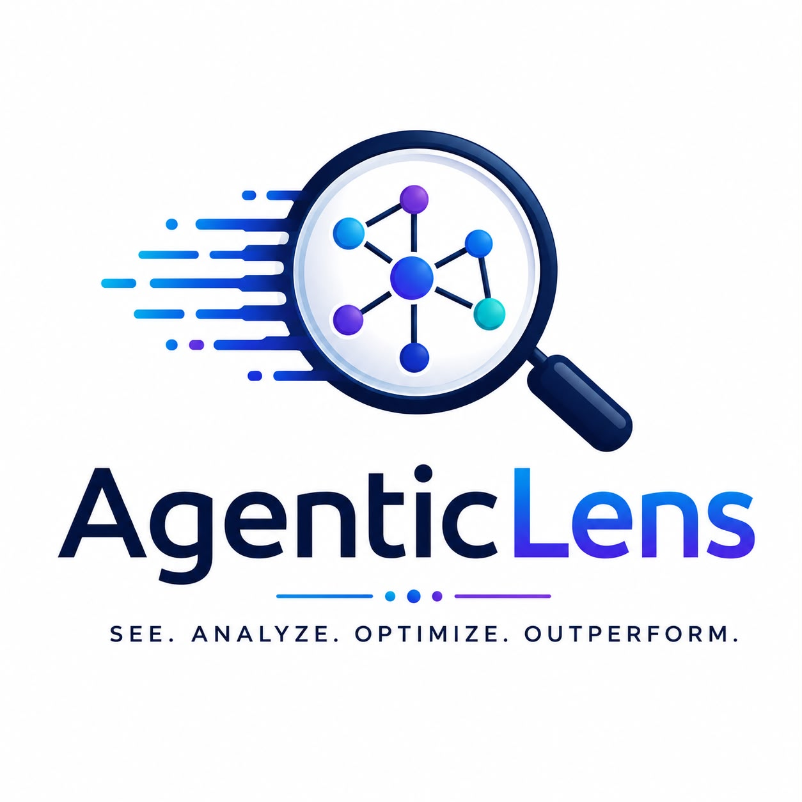

# AgenticLens

<p align="center">
  
</p>

**Open-source observability, evaluation, and operational intelligence for production AI systems.**

[](https://github.com/DeepAgentLabs/agenticlens/actions/workflows/ci.yml)
[](https://github.com/DeepAgentLabs/agenticlens/actions/workflows/docs.yml)
[](https://pypi.org/project/agenticlens/)
[](https://pypi.org/project/agenticlens/)
[](LICENSE)
[](https://github.com/DeepAgentLabs/agenticlens/stargazers)
[](https://github.com/DeepAgentLabs/agenticlens/forks)
[](https://pepy.tech/project/agenticlens)

| Public asset | Link |
| --- | --- |
| Website and docs | [GitHub Pages](https://deepagentlabs.github.io/agenticlens/) |
| Technical specification | [AgenticLens_Spec.md](AgenticLens_Spec.md) |
| Workflow specification | [docs/workflow-schema-spec.md](docs/workflow-schema-spec.md) |
| Roadmap | [ROADMAP.md](ROADMAP.md) |

AgenticLens is an open-source Python operational toolkit for LLM applications
and agentic workflows. It helps developers instrument the AI runtime they are
actually building: workflows, agents, LLM calls, prompts, context, retrieval,
memory, tools, MCP actions, evaluations, safety signals, and reliability
events.

It then turns that runtime into inspectable local artifacts, telemetry, and
actionable recommendations.

Think of it as a lightweight, local `cProfile` for AI workflows: no hosted
dashboard, no required backend, no account, and no data egress just to inspect a
run.

The product idea is simple:

`instrument the AI runtime once, export everywhere`

## Contents

- [Why AgenticLens?](#why-agenticlens)
- [Architecture](#architecture)
- [Status](#status)
- [Installation](#installation)
- [Quickstart](#quickstart)
- [Structured Agent Tracing](#structured-agent-tracing)
- [Privacy-Preserving Capture](#privacy-preserving-capture)
- [Memory and Retry Diagnostics](#memory-and-retry-diagnostics)
- [Repeated-Run Comparison](#repeated-run-comparison)
- [Using Regression Checks in CI](#using-regression-checks-in-ci)
- [Portable Schemas](#portable-schemas)
- [Features](#features)
- [Cost Calculation](#cost-calculation)
- [Configuration Reference](#configuration-reference)
- [CLI Reference](#cli-reference)
- [Current Limitations](#current-limitations)
- [Development](#development)
- [Roadmap](#roadmap)

## Why AgenticLens?

LLM applications rarely spend money in one place. Cost often leaks across
planners, retrievers, memory, tool calls, repeated system prompts, and final
response steps.

Most observability tools can show token usage. AgenticLens focuses on the next
questions:

> What ran, why did it behave that way, what should I change, and can I export
> that evidence anywhere I need?

AgenticLens currently detects token waste patterns such as:

- repeated system prompts that may be cached or deduplicated
- excessive retrieved chunks in RAG workflows
- low-utility retrieved chunks that appear unlikely to affect the final answer
- long conversation history that should be summarized or truncated
- duplicate tool calls that should be cached
- model-tier mismatches where a lower-cost model may handle the recorded workload
- projected token, dollar-per-run, and monthly savings

It can also capture hierarchical agent traces, measure memory and retry
overhead, compare repeated baseline and candidate runs, and fail CI when a
candidate exceeds configured regression limits.

## Architecture

AgenticLens provides two compatible instrumentation paths:

```text
Application code
├── Workflow profiler
│   ├── profile() and step()
│   ├── provider usage extraction
│   ├── automatic cost calculation
│   └── optimization recommendations
│
└── Research trace API
    ├── trace() and nested spans
    ├── raw execution metrics
    ├── deterministic findings
    └── repeated-run comparison

Local artifacts
├── workflow JSON
├── run trace JSON
├── comparison JSON and CSV
├── Markdown
└── Jira-oriented output
```

Use the workflow profiler for step-level token and cost optimization with
provider response extraction. Use the trace API for hierarchical execution
evidence, memory/retry analysis, and repeated-run experiments. Applications may
use both while the research API evolves.

AgenticLens remains package-first, local-first, framework-neutral, CI-friendly,
and advisory-first. It does not require a hosted backend and does not
automatically change production prompts, models, tools, or routing.

## Step-Level Token Optimization

AgenticLens is designed to make token waste visible at the level where engineers
can actually fix it:

| Workflow area | What AgenticLens flags | Typical fix |
| --- | --- | --- |
| Prompting | Repeated system prompt prefixes | Cache or deduplicate stable prompt blocks |
| RAG | Too many retrieved chunks | Lower top-k or tighten retrieval filters |
| RAG | Low-utility chunks unlikely to affect the final answer | Rerank, prune, or improve retrieval scoring |
| Memory | Long conversation history | Summarize or truncate older turns |
| Tools | Duplicate tool calls with the same arguments | Cache tool results |
| Multi-agent handoffs | Large context passed between agents | Pass structured summaries or key facts |
| Model selection | A lower-cost candidate can process the recorded token volume | Evaluate the candidate against quality requirements before switching |

The `analyze` command reports reducible tokens by step, so teams can see whether
the biggest opportunity is in retrieval, memory, planning, tool use, or final
response generation.

For multi-agent workflows, pass `agent_name` and optional handoff metadata:

```python
with step(
    "Research answer",
    type="llm_call",
    agent_name="research_agent",
    agent_role="researcher",
    handoff_from="planner_agent",
    handoff_to="answer_agent",
    handoff_tokens=5200,
):
    ...
```

## Status

AgenticLens is early-stage software. Workflow profiling, structured execution
tracing, cost calculation, deterministic diagnostics, repeated-run comparison,
export, CLI, and the rule-based recommendation engine are implemented. The
research trace API is experimental and may evolve before a stable 1.0 release.

| Capability | Status |
| --- | --- |
| Workflow and step profiler | Implemented |
| OpenAI and Anthropic usage extraction | Implemented |
| Live, cached, bundled, and overridden pricing | Implemented |
| Rule-based token optimization | Implemented |
| RAG chunk-utility analysis | Implemented |
| Hierarchical run/span tracing | Implemented, experimental |
| Memory and retry overhead findings | Implemented, experimental |
| Repeated-run regression comparison | Implemented, experimental |
| Evaluation SDK and test suites | Planned |
| Statistical significance testing | Planned |
| Framework trace adapters and OpenTelemetry export | Planned |
| Dashboard, ModelFit, and governance | Planned |

## Installation

For local development from this repository:

```bash
git clone https://github.com/DeepAgentLabs/agenticlens.git
cd agenticlens
uv sync --extra dev
```

If you do not use `uv`, install in editable mode with development extras:

```bash
python -m venv .venv
. .venv/bin/activate
pip install -e ".[dev]"
```

On Windows PowerShell:

```powershell
python -m venv .venv
.\.venv\Scripts\Activate.ps1
pip install -e ".[dev]"
```

## Quickstart

Instrument your workflow with explicit `profile()` and `step()` blocks:

```python
from agenticlens import profile, step

with profile("Customer Support Agent"):
    with step(
        "Planner",
        type="planner",
        provider="openai",
        model="gpt-4o-mini",
        prompt=planner_prompt,
    ) as s:
        response = planner_llm.invoke(planner_prompt)
        s.record(response)

    with step(
        "Retriever",
        type="retriever",
        chunk_count=12,
        avg_tokens_per_chunk=80,
    ):
        chunks = retriever.search(user_question)

    with step(
        "Final Answer",
        type="final_response",
        provider="openai",
        model="gpt-4o-mini",
        final_answer="Refunds are processed to the original payment method.",
    ) as s:
        response = answer_llm.invoke(final_prompt)
        s.record(response)
```

Then profile and analyze a script:

```bash
uv run agenticlens profile examples/recommendations_demo.py --save workflow.json
uv run agenticlens analyze workflow.json
```

Example output:

```text
Budget Optimization Run cost: $0.0068; reducible: ~$0.0024/run (35%), ~$2.38/month.

Optimization Suggestions
  * Long conversation history
  * Excessive retrieved chunks
  * Repeated system prompt
  * Low-utility retrieved chunks
  * Duplicate tool call

Estimated Savings: 35%
```

## Structured Agent Tracing

The research trace API represents one agent execution as a `Run` containing
nested `Span` objects. It is framework- and provider-neutral and is additive to
the existing `profile()` and `step()` API.

```python
from agenticlens import SpanType, trace

with trace(
    "customer-support-agent",
    environment="staging",
    prompt_version="support-v4",
) as recording:
    with recording.span("create-plan", SpanType.PLANNING) as planner:
        plan = create_plan()
        planner.record_tokens(input_tokens=300, output_tokens=75)

    with recording.span("load-history", SpanType.MEMORY_READ) as memory:
        history = load_customer_history()
        memory.record_tokens(input_tokens=800)

    with recording.span("search-account", SpanType.TOOL_CALL) as tool:
        account = search_account()
        tool.record_tokens(input_tokens=50, output_tokens=120)

    with recording.span("generate-answer", SpanType.MODEL_CALL) as model:
        answer = generate_answer(account, history)
        model.record_tokens(input_tokens=1200, output_tokens=250)
        model.record_cost(0.021)

recording.save("run.json")
```

Supported span types include planning, model calls, memory reads and writes,
retrieval, tool calls, validation, retries, delegation, final responses, and
custom operations.

Each run can report:

- total input, output, and combined tokens
- end-to-end and per-span latency
- estimated cost
- tokens and latency by span type
- tool-call and retry counts
- execution status and captured exceptions
- memory and retry overhead

Parent-child span relationships preserve execution structure, such as a retry
that occurred inside a failed tool call. Saved traces are validated for
duplicate IDs, missing parents, and self-parent relationships.

Inspect a saved trace:

```bash
agenticlens inspect run.json
```

The terminal report includes a run summary, nested span tree, token and latency
distributions, errors, retries, and deterministic findings.

### Trace lifecycle

```text
trace() entered
    ↓
Run created with status "running"
    ↓
Nested spans record operations
    ↓
Each span records timing, usage, status, and optional evidence
    ↓
Exceptions mark the active span and run as "failed"
    ↓
Run receives its completion time and final status
    ↓
Run is saved as portable JSON
```

Exceptions are recorded but not swallowed. The original exception continues to
propagate so application behavior is unchanged:

```python
with trace("tool-agent") as recording:
    with recording.span("lookup", SpanType.TOOL_CALL):
        raise TimeoutError("Customer database timed out")
```

Runs carry identity, application, framework, task, experiment, timing, status,
success, error, and metadata fields. Spans carry parent relationships, type,
agent, provider, model, tool, retry, usage, timing, cost, status, error,
references, optional redacted payloads, and extensible attributes.

Run totals are reproducible from the recorded spans:

```text
total_input_tokens  = sum(span.input_tokens)
total_output_tokens = sum(span.output_tokens)
total_tokens        = input + output
estimated_cost      = sum(known span costs)
end-to-end latency  = completed_at - started_at
```

## Privacy-Preserving Capture

Prompts, responses, and tool arguments are not captured by default. Applications
must explicitly opt in:

```python
with recording.span("model", SpanType.MODEL_CALL) as span:
    response = call_model(request)
    span.record_io(input_data=request, output_data=response)
```

Explicitly captured values pass through a recursive redactor. The default
redactor covers common secret fields, authorization values, bearer tokens,
cookies, passwords, API keys, and email addresses. A custom `redactor=`
function can be supplied for application-specific requirements.

The built-in redactor is a defense-in-depth control, not a complete compliance
or data-loss-prevention system. Teams should still minimize payload capture and
apply their own retention and access policies.

## Memory and Retry Diagnostics

AgenticLens calculates:

```text
memory_share = memory_tokens / total_tokens
retry_token_share = retry_tokens / total_tokens
retry_latency_share = retry_latency / total_latency
```

It also reports retry count, retry latency, and retry cost. When memory or retry
consumption exceeds a configured threshold, AgenticLens produces a deterministic
finding containing:

- the measured values
- the threshold that was exceeded
- severity and confidence
- exact span IDs that contributed to the finding

These findings identify measurable overhead. They do not yet determine whether
memory was relevant or classify retries as useful, wasteful, or unresolved.

## Repeated-Run Comparison

Agent systems are nondeterministic, so one run is rarely sufficient. Store
baseline and candidate traces in separate directories:

```text
results/
  baseline/
    run-001.json
    run-002.json
  candidate/
    run-001.json
    run-002.json
```

Then compare them:

```bash
agenticlens compare results/baseline results/candidate
```

For each group, AgenticLens calculates:

- run count and task-success rate
- mean, median, and P95 tokens
- mean, median, and P95 latency
- standard deviation and coefficient of variation
- mean cost and cost per successful task

The comparison detects relative regressions in success rate, mean tokens,
latency, and cost. The threshold is configurable:

```bash
agenticlens compare results/baseline results/candidate \
  --regression-threshold 0.05 \
  --save comparison.json
```

Use CSV for tabular analysis:

```bash
agenticlens compare results/baseline results/candidate \
  --save comparison.csv \
  --format csv
```

Use `--fail-on-regression` to return a nonzero exit status in CI:

```bash
agenticlens compare results/baseline results/candidate \
  --regression-threshold 0.05 \
  --fail-on-regression
```

Current comparisons are descriptive. They do not claim statistical
significance or causal attribution, especially for small or uncontrolled
samples.

### Designing a useful comparison

For credible results:

1. Use the same test cases for baseline and candidate conditions.
2. Keep unrelated settings fixed.
3. Record prompt, model, tool, and dataset versions in run metadata.
4. Run multiple trials per test case.
5. Preserve failed runs instead of deleting them.
6. Compare success and quality alongside cost and latency.
7. Review trace-level evidence before accepting an aggregate conclusion.

A 5% regression flag means the configured relative threshold was exceeded. It
does not mean the difference is statistically significant.

### Interpreting cost per successful task

Average request cost can favor a cheap but unreliable configuration:

```text
cost_per_successful_task = total_recorded_cost / successful_runs
```

| Variant | Mean run cost | Success rate | Cost per success |
| --- | ---: | ---: | ---: |
| Small model | $0.04 | 50% | $0.08 |
| Larger model | $0.06 | 100% | $0.06 |

Here, the larger model costs more per attempt but less per successful task.

## Using Regression Checks in CI

Store or download a reviewed baseline, generate candidate traces in the build,
and compare them:

```yaml
name: Agent regression check

on:
  pull_request:

jobs:
  agent-regression:
    runs-on: ubuntu-latest
    steps:
      - uses: actions/checkout@v4
      - uses: astral-sh/setup-uv@v6
      - run: uv sync --extra dev
      - name: Generate candidate traces
        run: uv run python benchmarks/run_candidate.py
      - name: Compare with baseline
        run: |
          uv run agenticlens compare \
            benchmarks/baseline \
            benchmarks/candidate \
            --regression-threshold 0.05 \
            --save comparison.json \
            --fail-on-regression
      - uses: actions/upload-artifact@v4
        if: always()
        with:
          name: agenticlens-comparison
          path: comparison.json
```

`--fail-on-regression` returns exit code `2` when the comparison is valid but
regressions are detected. Invalid inputs or unreadable traces return exit code
`1`.

## Portable Schemas

Versioned JSON Schemas are provided for:

- run traces: `schemas/trace.schema.json`
- deterministic findings: `schemas/finding.schema.json`
- comparison reports: `schemas/report.schema.json`

The schemas are included in wheel distributions under `agenticlens/schemas`.
They allow external systems to validate and consume artifacts without depending
on AgenticLens internal Python classes.

| Artifact | Purpose |
| --- | --- |
| Workflow JSON | Existing profiler output and recommendation input |
| Run trace JSON | Hierarchical research execution record |
| Finding JSON | Deterministic diagnostic evidence |
| Comparison JSON | Complete machine-readable baseline/candidate report |
| Comparison CSV | Flat metric deltas for analysis and charts |

The run trace and workflow artifact are related but currently distinct.
Consumers should inspect the artifact schema rather than assuming they are
interchangeable.

## Core Concepts

### Workflow

A workflow is one complete execution of an LLM application, such as answering a
customer support question or running a multi-agent task.

```python
with profile("Refund Support"):
    ...
```

### Step

A step is a meaningful unit inside that workflow: planner, retriever, memory,
tool call, LLM call, or final response.

```python
with step("Retrieve Policy Chunks", type="retriever", chunk_count=10):
    ...
```

### Recommendation

A recommendation is a rule-based optimization suggestion. Recommendations carry
token savings, estimated percentage savings, dollar impact when pricing is
known, confidence when relevant, and quality-risk notes for heuristics such as
RAG chunk utility.

### AI Runtime Objects

AgenticLens is moving toward an object-based model aligned with the AI
Operations Specification. At a high level, the runtime includes:

- `Workflow`
- `Request`
- `Agent`
- `LLM`
- `Prompt`
- `Context`
- `RAG`
- `Memory`
- `Tool`
- `MCP`
- `Evaluation`
- `Safety`
- `Reliability`
- `Incident`

These runtime objects emit AI-native events such as `workflow.run`,
`agent.step`, `llm.call`, `prompt.render`, `rag.retrieve`, `memory.read`, and
`tool.call`.

## Features

| Area | Capability |
| --- | --- |
| Profiling | Explicit `profile()` and `step()` context managers |
| Tracing | Framework-neutral `Run` and nested `Span` execution traces |
| Metrics | Prompt tokens, completion tokens, total tokens, latency, TPS, cost |
| Diagnostics | Memory-share and retry-overhead findings with span-level evidence |
| Comparison | Repeated runs, P95, variability, cost per success, regression detection |
| Privacy | Opt-in payload capture with recursive redaction |
| Providers | OpenAI and Anthropic response usage extraction |
| Costing | User overrides, cached live LiteLLM pricing, bundled fallback pricing |
| Recommendations | Repeated prompts, excessive chunks, low-utility chunks, long history, duplicate tool calls |
| Budget impact | Dollar-per-run and monthly savings projections |
| CLI | `profile`, `report`, `analyze`, `inspect`, and `compare` commands |
| Export | Workflow reports, run traces, JSON, CSV, Markdown, and Jira |
| Schemas | Versioned trace, finding, and comparison-report JSON Schemas |
| Tooling | pytest, Ruff, mypy, GitHub Actions |

## Cost Calculation

AgenticLens calculates per-step cost from the provider, model, prompt tokens,
and completion tokens recorded by the profiler:

```text
input_cost = (prompt_tokens / 1000) * input_price_per_1k
output_cost = (completion_tokens / 1000) * output_price_per_1k
total_cost = input_cost + output_cost
```

Pricing resolution order:

1. User-supplied pricing override
2. Live LiteLLM community pricing feed, when enabled
3. Bundled `src/agenticlens/config/pricing.yaml`
4. Unknown model: cost is reported as `None`, not `$0.00`

Live pricing is enabled by default. AgenticLens downloads LiteLLM's
community-maintained model pricing table and stores it in:

```text
~/.cache/agenticlens/live_pricing_cache.json
```

The default cache lifetime is 24 hours and the default network timeout is five
seconds. A fresh cache avoids another network request. If refresh fails,
AgenticLens uses the stale cache when one exists; otherwise it falls back to the
bundled table.

Live entries are converted from cost per token into AgenticLens's internal USD
per 1,000-token representation. Model lookup supports direct model names,
`provider/model` names, and explicit aliases for provider feeds whose versioned
keys differ from AgenticLens model names.

Configure pricing with an AgenticLens YAML file:

```yaml
pricing_overrides:
  "openai:internal-fine-tune":
    input_per_1k: 0.002
    output_per_1k: 0.008

live_pricing:
  enabled: true
  ttl_seconds: 86400
  timeout_seconds: 5
  cache_path: ".agenticlens/live_pricing_cache.json"
```

Point AgenticLens at the file with:

```bash
export AGENTICLENS_CONFIG=agenticlens.yaml
```

On Windows PowerShell:

```powershell
$env:AGENTICLENS_CONFIG = "agenticlens.yaml"
```

For hermetic builds, offline execution, or tests, disable remote pricing:

```bash
export AGENTICLENS_DISABLE_LIVE_PRICING=1
```

User overrides always win, including when live pricing is enabled. This is
useful for negotiated provider rates, private deployments, fine-tuned models,
or internal chargeback prices.

When pricing cannot be resolved, AgenticLens emits an
`UnknownModelPricingWarning` and preserves the cost as `None`. Reports render
that value as unavailable rather than incorrectly treating an unknown model as
free.

### Model-Swap Cost Analysis

The model-swap recommender recalculates the current step cost using the active
pricing configuration and compares it with lower-cost candidates. It uses the
live LiteLLM table when available and the bundled table as a fallback.

Candidate discovery is restricted by default to a curated list of direct model
providers so gateway and reseller aliases do not overwhelm the comparison.
Recommendations include:

- current provider and model
- candidate provider and model
- measured token volume used in the estimate
- current and projected candidate cost
- projected dollar and percentage savings
- a quality-risk warning

A cheaper model is a candidate for evaluation, not an automatic replacement.
AgenticLens does not claim equivalent quality and does not change production
routing.

### Cost-Aware Reports and Comparisons

Resolved step costs flow into:

- workflow total cost
- per-step and per-agent CLI summaries
- JSON, CSV, Markdown, and Jira exports
- projected recommendation savings
- repeated-run mean cost
- cost per successful task
- baseline-versus-candidate cost regression detection

Trace spans also accept explicitly recorded estimated costs through
`span.record_cost()`. Trace cost is currently caller-supplied; automatic pricing
resolution is implemented for the existing `profile()` and `step()` workflow
profiler.

## Configuration Reference

AgenticLens loads YAML configuration from an explicit path passed to
`load_config()`, from `AGENTICLENS_CONFIG`, or from defaults.

```yaml
pricing_overrides:
  "openai:internal-fine-tune":
    input_per_1k: 0.002
    output_per_1k: 0.008

live_pricing:
  enabled: true
  url: "https://raw.githubusercontent.com/BerriAI/litellm/main/model_prices_and_context_window.json"
  cache_path: ".agenticlens/live_pricing_cache.json"
  ttl_seconds: 86400
  timeout_seconds: 5

recommender:
  system_prompt_prefix_tokens: 50
  max_chunks: 8
  history_token_limit: 4000
  monthly_runs: 1000
  warning_savings_pct: 5
  critical_savings_pct: 20
  warning_savings_usd: 0.005
  critical_savings_usd: 0.05
  rag_min_chunk_utility_score: 0.08
  rag_min_low_utility_chunks: 2
  handoff_token_limit: 3000
  model_swap_min_savings_pct: 15
  model_swap_providers:
    - openai
    - anthropic
    - gemini
```

| Environment variable | Purpose |
| --- | --- |
| `AGENTICLENS_CONFIG` | Path to an AgenticLens YAML configuration file |
| `AGENTICLENS_DISABLE_LIVE_PRICING` | Disable remote pricing and use cache/static fallback |

Configuration through `[tool.agenticlens]` in `pyproject.toml` is planned but
is not implemented yet.

## RAG Chunk Utility

The RAG utility rule identifies retrieved chunks that are unlikely to influence
the final answer. It supports multiple signal types (in priority order):

| Signal Type | Supported Fields | Source |
| --- | --- | --- |
| Citation | `cited`, `used`, `referenced` (boolean) | Your app logic |
| Reranker | `reranker_score`, `rerank_score`, `cross_encoder_score` (0–1) | Cross-encoder models |
| Embedding | `embedding_similarity`, `cosine_similarity`, `semantic_score` (0–1) | Vector search |
| Generic | `utility_score`, `relevance_score` (0–1) | Custom scoring |
| Fallback | Word-overlap against final answer | Automatic |

Example chunk metadata:

```python
{"text": "...", "reranker_score": 0.92}
{"text": "...", "cosine_similarity": 0.85}
{"text": "...", "cited": True}
{"text": "...", "utility_score": 0.12}
```

When rich signals (reranker, embedding, citation) are available, confidence is
higher and quality risk is lower. If no explicit signals are present, it falls
back to lightweight word-overlap against the final answer.

For a complete guide, see [docs/rag-chunk-utility.md](docs/rag-chunk-utility.md).

## Examples

Run the recommendation demo:

```bash
uv run agenticlens profile examples/recommendations_demo.py --save workflow.json
uv run agenticlens analyze workflow.json
```

Other examples:

- `examples/basic_usage.py`
- `examples/rag_customer_support_demo.py`
- `examples/multiagent_support_demo.py`
- `examples/multiagent_token_optimization_demo.py`
- `examples/export_demo.py` — export to Markdown and Jira
- `examples/rag_scoring_demo.py` — RAG chunk utility with reranker/embedding/citation signals

Some examples call real provider APIs and require provider API keys.

## Exporting Reports

### Markdown

```python
from agenticlens.exporters import MarkdownExporter

MarkdownExporter().export(workflow, "report.md")
```

### With Recommendations

All exporters accept an optional `recommendations` parameter (Jira currently ignores it):

```python
from agenticlens.exporters import MarkdownExporter, JSONExporter, CSVExporter
from agenticlens.recommenders import RecommendationEngine

engine = RecommendationEngine()
recs = engine.run(workflow)

MarkdownExporter().export(workflow, "report.md", recommendations=recs)
JSONExporter().export(workflow, "report.json", recommendations=recs)
CSVExporter().export(workflow, "steps.csv", recommendations=recs)
# CSV also writes steps_recommendations.csv alongside
```

### Jira Integration

Post profiling results directly as a comment on a Jira issue:

```python
from agenticlens.exporters import JiraExporter

JiraExporter(
    base_url="https://yourteam.atlassian.net",
    user_email="you@example.com",
    api_token="your-api-token",
    issue_key="PROJ-123",
).export(workflow)
```

Set credentials via environment variables for safety — see
`examples/export_demo.py` for a complete example.

For sample output previews of all formats, see [docs/export-formats.md](docs/export-formats.md).

## CLI Reference

Profile a Python script:

```bash
uv run agenticlens profile app.py
```

Save a workflow report:

```bash
uv run agenticlens profile app.py --save workflow.json
```

Display a saved workflow:

```bash
uv run agenticlens report workflow.json
```

Analyze a saved workflow:

```bash
uv run agenticlens analyze workflow.json
```

Inspect a saved run trace:

```bash
uv run agenticlens inspect run.json
```

Compare baseline and candidate traces:

```bash
uv run agenticlens compare results/baseline results/candidate
```

Save a comparison and fail CI on detected regressions:

```bash
uv run agenticlens compare results/baseline results/candidate \
  --save comparison.json \
  --fail-on-regression
```

### Command summary

| Command | Purpose |
| --- | --- |
| `profile` | Run an instrumented Python script and optionally save its workflow |
| `report` | Render an existing workflow JSON artifact |
| `analyze` | Run optimization recommenders against a workflow |
| `inspect` | Render a run trace, span tree, distributions, and findings |
| `compare` | Compare baseline and candidate trace files or directories |

The `compare` command accepts either one JSON trace file or a directory of
`*.json` traces for each condition.

## Current Limitations

- The research trace API and workflow profiler use separate artifact types.
- Trace-span cost must currently be recorded by the caller.
- Memory findings measure consumption, not semantic relevance or contribution.
- Retry findings measure overhead but do not classify recovery outcomes.
- Context-duplication detection is not implemented yet.
- Comparisons do not calculate confidence intervals or significance tests yet.
- No built-in task-quality evaluator is available yet.
- Model-swap recommendations estimate cost and do not guarantee quality.
- Live pricing uses a community-maintained feed that may lag provider changes.
- Default redaction cannot guarantee removal of every domain-specific secret or
  personal identifier.
- Framework adapters, OpenTelemetry export, and a local dashboard remain
  planned.

## Development

Install development dependencies:

```bash
uv sync --extra dev
```

Run the test suite:

```bash
uv run pytest
```

Run linting, formatting, and type checks:

```bash
uv run ruff check .
uv run ruff format .
uv run mypy
```

Useful targeted checks while working:

```bash
uv run ruff check src tests
uv run ruff format --check src tests
```

## Project Structure

```text
src/agenticlens/
  instrumentation/ structured run and span tracing, payload redaction
  analysis/        memory and retry diagnostics
  comparison/      repeated-run statistics, regression reports, export
  reports/         trace inspection rendering
  profiler/       workflow and step profiling
  metrics/        cost and performance calculation
  providers/      provider response usage extraction
  recommenders/   rule-based optimization suggestions
  exporters/      JSON, CSV, Markdown, and Jira exports
  cli/            Typer CLI and Rich rendering
  config/         pricing and settings
  models/         Pydantic data models
schemas/           versioned trace, finding, and report JSON Schemas
```

## Roadmap

Near-term priorities:

- context-duplication detection
- retry classification and triggering-failure association
- experiment manifests and confidence intervals
- evaluation test cases, suites, evaluators, and scores
- automatic pricing resolution for research trace spans
- prompt caching opportunity detection
- integrations for LangChain, LangGraph, LiteLLM, and OpenAI Agents SDK
- OpenTelemetry and OpenInference trace import
- optional prompt compression handoff

See [ROADMAP.md](ROADMAP.md) and [AgenticLens_Spec.md](AgenticLens_Spec.md) for
more detail.

## Contributing

Contributions are welcome. Good first areas include:

- provider integrations
- recommender rules
- example workflows
- docs and tutorials
- export formats
- test coverage

Please read [CONTRIBUTING.md](CONTRIBUTING.md) before opening a pull request.

## Security

Please report vulnerabilities privately. See [SECURITY.md](SECURITY.md).

## Code of Conduct

This project follows [CODE_OF_CONDUCT.md](CODE_OF_CONDUCT.md).

## License

AgenticLens is released under the MIT License. See [LICENSE](LICENSE).
